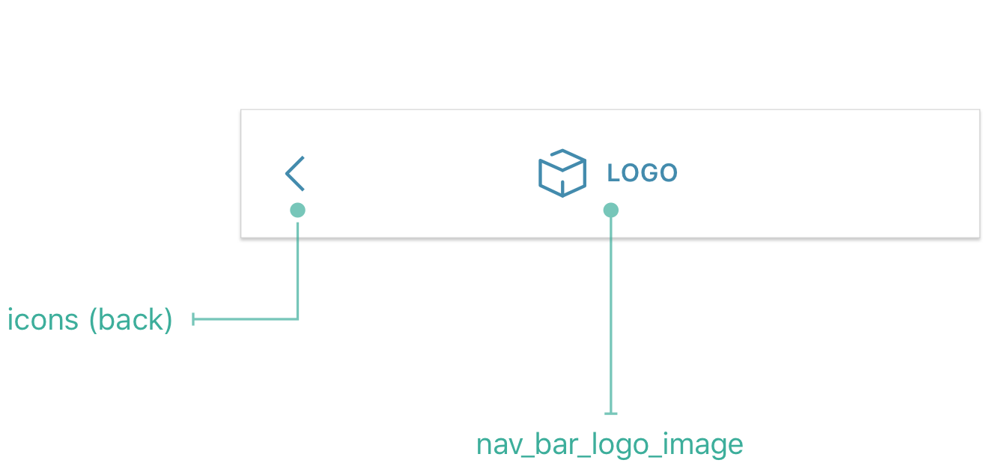
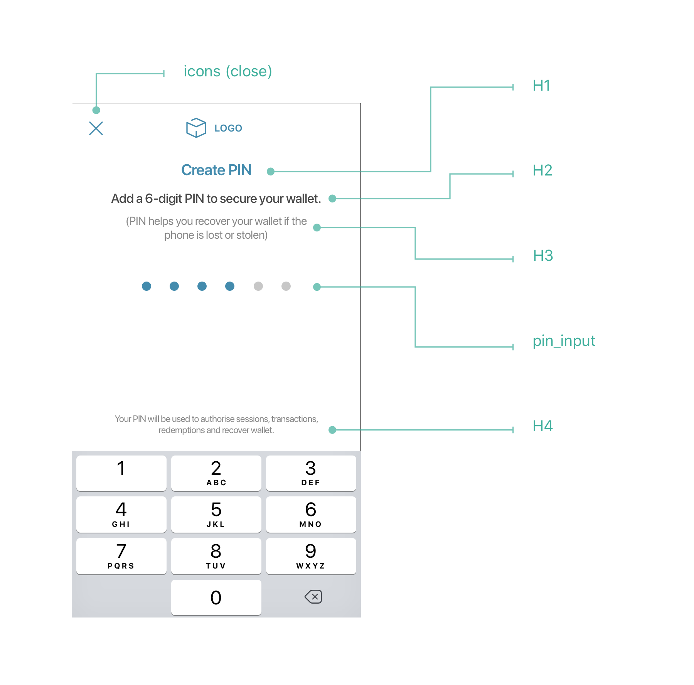
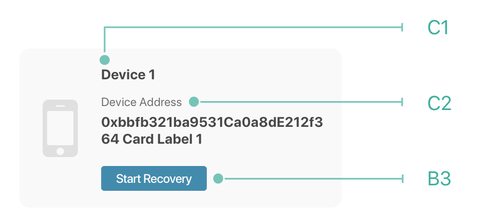

# Theme Config
## Config Structure
* First level of json is `component name`.
* Values for component are properties which applies to respective components.
```json
{
    "COMPONENT_NAME": {
        "PROPERTY": "<VALUE>"
    }
}
```
> **important**
> 1. Application navigation bar logo image should be added in `assets` folder for iOS/android.
> 2. Value for `nav_bar_logo_image -> asset_name` should be updated with *asset_name* else OST placehoder image will be applied.
> 3. Incase of missing properties, default values will be applied to respective components.

## UI Components 







## Components

OstWalletUI containts 4 kind of UI components. 

 ### Label
 Label is categorized as :
 * [H1](ThemeConfig.md#theme-json)
 * [H2](ThemeConfig.md#theme-json)
 * [H3](ThemeConfig.md#theme-json)
 * [H4](ThemeConfig.md#theme-json)
 * [C1](ThemeConfig.md#theme-json)
 * [C2](ThemeConfig.md#theme-json)

 **Customizable Properties**<br/>
 &nbsp;_size: Label size_<br/>
 &nbsp;_font: Font for label. If Font is not found or not provied, system font will be applied with `system_font_weight` value._<br/>
 &nbsp;_color: Color of label_<br/>
 &nbsp;_alignment: Alignment for label_<br/>
 &nbsp;_system_font_weight: Weight of system font._<br/>
 
 ### Button
 
 Button is categorized as :
 * [B1](ThemeConfig.md#theme-json)
 * [B2](ThemeConfig.md#theme-json)
 * [B3](ThemeConfig.md#theme-json)
 * [B4](ThemeConfig.md#theme-json)
 
 **Customizable Properties**<br/>
 &nbsp;_size: Button text size_<br/>
 &nbsp;_font: Font for button. If Font is not found or not provied, system font will be applied with `system_font_weight` value._<br/>
 &nbsp;_color: Title color of button_<br/>
 &nbsp;_background_color: Button background color_<br/>
 &nbsp;_system_font_weight: Weight of system font._<br/>
 
 ### Navigation Bar
 
 **Customizable Properties**<br/>
 * Navigation bar logo:
 Set value for key `nav_bar_logo_image -> asset_name` 
 * Navigation bar tint color:
 Set value for key `navigation_bar -> tint_color`
 *  Close icon tint color:
 Set value for key `icons -> close -> tint_color` 
 * Back icon tint color:
 Set value for key `icons -> back -> tint_color`
 
 ### Pin Input
 
 Style for pin input can be modified by updating values for key `pin_input`.
 
 **Customizable Properties**<br/>
 &nbsp;_empty_color: Empty dot color_<br/>
 &nbsp;_filled_color: Filled dot color_<br/>
    
## Theme JSON

To support custom font for application, please refer [apple documentation](https://developer.apple.com/documentation/uikit/text_display_and_fonts/adding_a_custom_font_to_your_app)

```json
{
    "nav_bar_logo_image": {
        "asset_name": "ost_nav_bar_logo"
    },

    "h1": {
        "size": 20,
        "font": "Lato",
        "color": "#438bad",
        "system_font_weight": "semi_bold",
        "alignment": "center"
    },

    "h2": {
        "size": 17,
        "color": "#666666",
        "font": "Lato",
        "system_font_weight": "medium",
        "alignment": "center"
    },

    "h3": {
        "size": 15,
        "color": "#888888",
        "font": "Lato",
        "system_font_weight": "regular",
        "alignment": "center"
    },

    "h4": {
        "size": 12,
        "color": "#888888",
        "font": "Lato",
        "system_font_weight": "regular",
        "alignment": "center"
    },

    "c1": {
        "size": 14,
        "color": "#484848",
        "font": "Lato",
        "system_font_weight": "bold",
        "alignment": "left"
    },

    "c2": {
        "size": 12,
        "color": "#6F6F6F",
        "font": "Lato",
        "system_font_weight": "regular",
        "alignment": "left"
    },

    "b1": {
        "size": 17,
        "color": "#ffffff",
        "font": "Lato",
        "background_color": "#438bad",
        "system_font_weight": "medium"
    },

    "b2": {
        "size": 17,
        "color": "#438bad",
        "font": "Lato",
        "background_color": "#f8f8f8",
        "system_font_weight": "semi_bold"
    },

    "b3": {
        "size": 12,
        "color": "#ffffff",
        "font": "Lato",
        "background_color": "#438bad",
        "system_font_weight": "medium"
    }, 

    "b4": {
        "size": 12,
        "color": "#438bad",
        "font": "Lato",
        "background_color": "#ffffff",
        "system_font_weight": "medium"
    },

    "navigation_bar": {
        "tint_color": "#ffffff"
    },

    "icons": {
        "close": {
            "tint_color": "#438bad"
        },
        "back":{
            "tint_color": "#438bad"
        }
    },

    "pin_input": {
        "empty_color": "#c7c7cc",
        "filled_color": "#438bad"
    }
}
```
